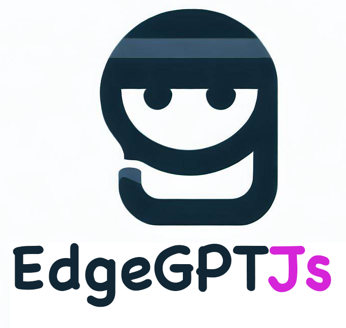

# EdgeGPTJs
[English](./README.md) | 简体中文
[](https://www.npmjs.com/package/edgegptjs)
[](https://opensource.org/licenses/MIT)

<!-- [](https://github.com/lonelam/EdgeGPTJs/actions) -->
<!-- [](https://codecov.io/gh/lonelam/EdgeGPTJs) -->



欢迎来到 EdgeGPTJs，这是一个受 Python 版本 [EdgeGPT](https://github.com/acheong08/EdgeGPT) 仓库启发的 Node.js 包。该包允许您反向工程新版 Bing 的聊天功能，使您更轻松地利用 Bing 的聊天功能在自己的项目中。

## 目录

- [EdgeGPTJs](#edgegptjs)
  - [目录](#目录)
  - [特性](#特性)
  - [路线图](#路线图)
  - [要求](#要求)
    - [检查访问（必需）](#检查访问必需)
    - [获取授权（必需）](#获取授权必需)
  - [提示工具使用](#提示工具使用)
  - [库使用](#库使用)
  - [贡献](#贡献)
  - [许可证](#许可证)

## 特性

- 反向工程新版 Bing 的聊天功能
- 易于使用的 API，并配有详尽的文档
- 高度可定制和可扩展

## 路线图
[x] CLI工具演示
[x] 可导出的npm包API
[] 一键远程部署，灵感来源于[ChatGPT-Next-Web](https://github.com/Yidadaa/ChatGPT-Next-Web)
[] 与[ChatGPT-Next-Web](https://github.com/Yidadaa/ChatGPT-Next-Web)集成

## 要求

- 具有对 https://bing.com/chat 的早期访问权限的 Microsoft 帐户（必需）
- 在支持的国家/地区具有 New Bing（需要中国大陆 VPN）

### 检查访问（必需）

  </summary>

- 安装最新版的微软 Edge 浏览器
- 或者，您可以使用任何浏览器，并将用户代理设置为看起来像您正在使用 Edge（例如， `Mozilla/5.0 (Windows NT 10.0; Win64; x64) AppleWebKit/537.36 (KHTML, like Gecko) Chrome/111.0.0.0 Safari/537.36 Edg/111.0.1661.51`）。您可以使用“User-Agent Switcher and Manager”扩展或[Chrome](https://chrome.google.com/webstore/detail/user-agent-switcher-and-m/bhchdcejhohfmigjafbampogmaanbfkg)和[Firefox](https://addons.mozilla.org/en-US/firefox/addon/user-agent-string-switcher/)浏览器中的类似扩展轻松实现此操作。
- 打开[bing.com/chat](https://bing.com/chat)
- 如果您看到聊天功能，则可以继续进行

</details>

<details>
  <summary>

### 获取授权（必需）

  </summary>

- 为[Chrome](https://chrome.google.com/webstore/detail/cookie-editor/hlkenndednhfkekhgcdicdfddnkalmdm)或[Firefox](https://addons.mozilla.org/en-US/firefox/addon/cookie-editor/)安装“Cookie Editor”扩展。
- 进入 `bing.com`
- 打开扩展程序
- 单击右下角的“导出”，然后单击“导出为 JSON”（这将您的 cookie 保存到剪贴板中）
- 将 cookie 粘贴到名为 `cookies.json` 的文件中

</details>

<details>

<summary>

## 提示工具使用
使用 ENVIRONMENT_VARIABLE 传递 cookie jar 文件
```
export COOKIE_FILE=/path/to/cookie.json
npx edgegptjs
```
或者使用
```bash
npx edgegptjs --cookie-file=cookie.json
```

## 库使用

要开始使用 EdgeGPTJs，请导入包并创建 `Chatbot` 的新实例：

```javascript
const { Chatbot } = require('edgegptjs');
const bot = new Chatbot(args.cookiePath);
await bot.chatHubInitialization;
const response = await bot.ask("What's the result of 1+1?");
console.log(`Bot: ${response}`);
```

有关 API 和可用方法的详细解释，请参阅[文档](https://github.com/lonelam/EdgeGPTJs/wiki)。

## 贡献


我们欢迎社区贡献。如果您想为 EdgeGPTJs 做出贡献，请阅读我们的 [贡献指南](https://github.com/lonelam/EdgeGPTJs/blob/main/CONTRIBUTING.md)。

## 许可证

EdgeGPTJs 发布遵循 [MIT 许可证](https://github.com/lonelam/EdgeGPTJs/blob/main/LICENSE)。

